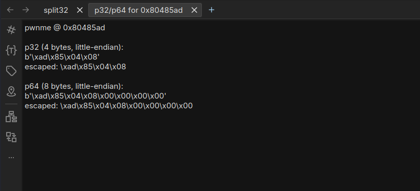

# binjapack

A tiny [Binary Ninja](https://binary.ninja) plugin to help you quickly pack addresses into **p32/p64** format while solving **pwn CTFs**.

Instead of manually typing `struct.pack("<I", addr)` or `struct.pack("<Q", addr)` in Python every time, you can right-click an instruction or address in Binary Ninja and instantly see/copy the packed forms.

---

## ✨ Features

- **Pack instruction address** into both **p32** (4 bytes, little-endian) and **p64** (8 bytes, little-endian).
- Output formats:
  - Python-ready `b"\xde\xad\xbe\xef"` style
  - Hex-escaped string `\xef\xbe\xad\xde`
- Two usage modes:
  - **View in Log** → prints results into Binary Ninja’s Log console.
  - **Show Report** → opens a plain-text popup with the packed values.

---

## 📷 Example

Right-click on any instruction and choose **Pack 32/64 → View In Log**

**Pack 32/64 → Show Report**

